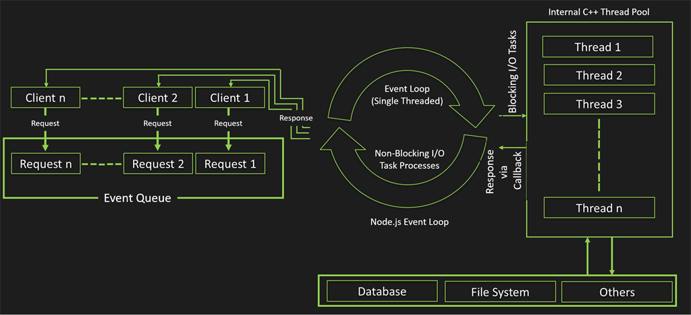

# Why NodeJS

Ideal for:
- I/O intensive applications such as file servers, CRUD APIs, API Proxies / Decorators / Facades
- Scripting - development pipeline automation - concatenation, minification, obfuscation
- Cross Platform desktop applications (NW.js / Electron)

---------------

## What is NodeJS?

An open source, cross platform runtime environment for Javascript.

---------------

## V8

- V8 is an open source JavaScript engine
- Written in C++
- Can run as standalone or be embedded into any C++ program
- Compiles Javascript into native code before execution. The compiled code is further optimized (Inlining, Elision and Inline Caching) to achieve very high performance

---------------

## Technical Aspects

- Single Threaded
- Non blocking I/O
- Event driven

---------------

## Single threaded?

---------------

## The Event Loop



---------------

## The Event Loop cont.

- Can be considered as the “Main” thread of the program
- Loops around all the commands of the program and executes the synchronously
- Callbacks are registered to the end of the Event Loop.
- When The Event Loop has no more actions to perform - the program exits

---------------

## Non-Blocking I/O

Nodejs implements the Reactor Pattern to handle multiple concurrent requests

The tasks (e.g. handling http requests) are inspected synchronously and passed on to asynchronous handlers for I/O operations such as disk read/write, DB queries, 3rd party API calls ets. these operations register callbacks to the event loop and are handled when they are done, without blocking the application thread

---------------

## Event Driven

- NodeJS is reactive in nature
- Relies on asyn operations to maintain performance
- Event Emmitter is a first class citizen

---------------

### Getting Started

1. Install NodeJS - [https://nodejs.org/en/download/](https://nodejs.org/en/download/)
2. `$ node`
3. `> console.log('hello world')`

> Windows users should install a shell application such as [Git Bash](https://gitforwindows.org/)

---------------

### My first script

```sh
$ cd /your/project/dir

$ code index.js

## Write some code in index.js

$ node index.js
# OR
$ node index
# OR
$ node .
```

---------------

## JS syntax support

Node support most of ESNext features

a full list can be found [here](https://node.green/)

---------------

## Managing node versions

```sh
$ npm i -g "n"

# OR
$ sudo npm i -g "n"

# ...
n latest
```

---------------

## Requireing libraries

```js
require varName from 'module_name'
```

```js
const fs = require('fs');

const data = fs.readFileSync('path/to/file, 'utf-8')

console.log(data);
```

---------------

### NodeJS modules

```md
assert- Provides a set of assertion tests
buffer- To handle binary data
child_process- To run a child process
cluster- To split a single Node process into multiple processes
crypto- To handle OpenSSL cryptographic functions
dgram- Provides implementation of UDP datagram sockets
dns- To do DNS lookups and name resolution functions
domain- Deprecated. To handle unhandled errors
events- To handle events
fs- To handle the file system
http- To make Node.js act as an HTTP server
https- To make Node.js act as an HTTPS server.
net- To create servers and clients
os- Provides information about the operation system
path- To handle file paths
punycode- Deprecated. A character encoding scheme
querystring- To handle URL query strings
readline- To handle readable streams one line at the time
stream- To handle streaming data
string_decoder- To decode buffer objects into strings
timers- To execute a function after a given number of milliseconds
tls- To implement TLS and SSL protocols
tty- Provides classes used by a text terminal
url- To parse URL strings
util- To access utility functions
v8- To access information about V8 (the JavaScript engine)
vm- To compile JavaScript code in a virtual machine
zlib- To compress or decompress files
```

---------------

## Async functions

- pass a callback function as the last parameter
- The first parameter in the callback is the error or null 

```js
const fs = require('fs');

fs.readFile(__filename, 'utf-8', (err, data) => {
    if(err) {
        console.log(err);
        return;
    }
    console.log(data);
})

```

---------------

## NPM - Node Package Manager

```sh
$ node -v
v14.8.0

$ npm -v
6.14.8

$ npm search "npm"
NAME                     -  DESCRIPTION         -  AUTHOR         -  DATE      -  VERSION -  KEYWORDS
npm                      -  a package manager…  -  =bonkydog =nlf…-  2020-08-17-  6.14.8  -  install modules package manager package.json
browserify               -  browser-side…       -  =ahdinosaur…   -  2020-08-03-  16.5.2  -  browser require commonjs commonj-esque bundle npm javascript
semver                   -  The semantic…       -  =bonkydog =nlf…-  2020-04-14-  7.3.2   - 
registry-auth-token      -  Get the auth token… -  =leipert…      -  2020-07-13-  4.2.0   -  npm conf config npmconf registry auth token authtoken
execa                    -  Process execution…  -  =ehmicky…      -  2020-07-07-  4.0.3   -  exec child process execute fork execfile spawn file shell bin binary binaries npm path local
update-notifier          -  Update…             -  =addyosmani…   -  2020-08-16-  4.1.1   -  npm update updater notify notifier check checker cli module package version
npm-run-all              -  A CLI tool to run…  -  =mysticatea    -  2018-11-24-  4.1.5   -  cli command commandline tool npm npm-scripts run sequential serial parallel task
validate-npm-package-name-  Give me a string…   -  =bonkydog =nlf…-  2017-02-13-  3.0.0   -  npm package names validation
npm-run-path             -  Get your PATH…      -  =sindresorhus  -  2019-12-22-  4.0.1   -  npm run path package bin binary binaries script cli command-line execute executable
archy                    -  render nested…      -  =substack      -  2014-09-14-  1.0.0   -  hierarchy npm ls unicode pretty print
@quantumart/mobx-form-val-  mobx typescript…    -  =akuznetsova…  -  2020-03-11-  1.2.1   -  npm package validation mobx react IE10
idation-kit              -                      -                 -            -          - 
npm-normalize-package-bin-  Turn any flavor of… -  =bonkydog =nlf…-  2019-12-09-  1.0.1   - 
nopt                     -  Option parsing for… -  =bonkydog =nlf…-  2020-08-17-  5.0.0   - 
npm-package-arg          -  Parse the things…   -  =bonkydog =nlf…-  2020-03-12-  8.0.1   - 
npm-check-updates        -  Find newer versions…-  =raine…        -  2020-09-22-  9.0.2   -  npm check find discover updates upgrades dependencies package.json updater version management ncu
in-publish               -  Detect if we were…  -  =iarna         -  2020-03-16-  2.0.1   - 
npm-pick-manifest        -  Resolves a matching…-  =bonkydog =nlf…-  2020-04-07-  6.1.0   -  npm semver package manager
npm-registry-fetch       -  Fetch-based http…   -  =bonkydog =nlf…-  2020-08-17-  8.1.4   -  npm registry fetch
standard-version         -  replacement for…    -  =bcoe =nexdrew…-  2020-08-15-  9.0.0   -  conventional-changelog recommended changelog automatic workflow version angular standard
is-npm                   -  Check if your code… -  =sindresorhus  -  2020-05-15-  5.0.0   -  npm yarn is check detect env environment run script

```

----